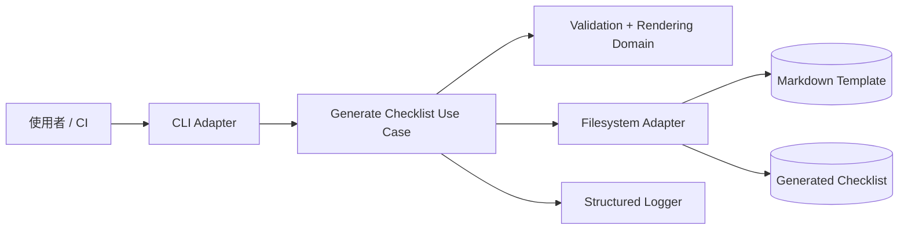

# AWS Static Site Checklist Generator

[](https://github.com/helloapple080/aws-static-site-checklist-generator/actions/workflows/ci.yml)
[](https://nodejs.org/)
[](LICENSE)

以 Node.js CLI 產生 **AWS S3 + CloudFront 靜態網站**的正式上線檢查清單。專案著重可驗證的輸入、檔案邊界、原子寫入、結構化日誌及 AWS 安全／維運準備。

> **狀態：** cloud-ready design；目前只在本機執行與測試，**尚未實際部署 AWS**。

## 能力

- S3、CloudFront、DNS、TLS、IAM、logging、監控、rollback 與災難復原檢查。
- domain、environment、控制字元與 template placeholder 驗證。
- project、owner、domain、environment 以 Markdown/HTML-safe text 插入，避免內容注入。
- 內建 template 可從任意工作目錄安全使用；自訂 template 與 output 限制在目前目錄。
- 使用同目錄暫存檔與 atomic rename，避免輸出只寫一半。
- stderr 輸出 JSON structured logs；stdout 僅輸出機器可解析的結果。
- 零第三方 runtime dependency，降低供應鏈風險。

## 架構



詳見 [架構文件](docs/architecture.md)。

## 前置需求

- Node.js 22 或更新的受支援版本
- npm 10+

## 快速開始

```bash
npm ci --ignore-scripts
npm run check
```

自訂輸出：

```bash
node src/generate-checklist.js \
  --project "Client Landing Page" \
  --domain "client.example.com" \
  --owner "Platform Team" \
  --environment "production" \
  --output examples/client-checklist.md
```

成功時 stdout：

```json
{"status":"ok","outputPath":"/absolute/path/examples/client-checklist.md","bytes":1234,"durationMs":1.23}
```

structured logs 寫入 stderr，方便 shell 將資料與日誌分流。可用 `LOG_LEVEL=debug|info|warn|error` 調整層級。

## 品質閘門

```bash
npm run lint
npm test
npm run coverage
npm audit --audit-level=high
```

`npm run check` 會執行前三個 deterministic gate，不會改寫 repo。`npm run generate` 是人工產生範例／checklist 的命令。

測試包含 unit、真實檔案 I/O integration、symlink/path traversal security 與 child-process E2E。

## 安全限制

- 自訂 `--template` 與 `--output` 必須位於執行命令的目前目錄內；repo 內建的預設 template 是唯一受信任例外。
- 不接受換行等控制字元；插入值會轉義 Markdown 結構字元與 HTML angle brackets。
- template 最大 1 MiB，且未支援 placeholder 會導致失敗。
- 本工具不登入 AWS、不讀取 `.env`、不建立或修改雲端資源。
- checklist 是人工品質閘門，不代表資源已自動符合要求。

## 文件

- [架構與資料流](docs/architecture.md)
- [資安與威脅模型](docs/security.md)
- [Logging、監控與維運](docs/operations.md)
- [測試與驗證證據](docs/verification.md)
- [ADR：模組化單體 CLI](docs/adr/0001-modular-monolith-cli.md)
- [作品案例](docs/case-studies/aws-static-site-checklist-generator.md)

## 已驗證成果

- 本機品質閘門：14/14 tests 通過。
- Coverage（`npm run check` 該次實測）：lines 97.92%、branches 92.80%、functions 96.97%。
- `npm audit --omit=dev --audit-level=high`：0 vulnerabilities。
- GitHub Actions 使用 Node.js 22、24 matrix；遠端結果請查看上方 CI badge。
- 所有數據都是本機或 CI 實測；專案尚未部署 AWS。

## 後續上雲路線

如果未來需要服務化，優先將 application/domain 保持不變，新增 API Gateway + Lambda adapter、S3 output adapter、CloudWatch embedded metrics 與最小權限 IaC。只有在確認多人／遠端呼叫需求、成本與維運責任後才服務化。
