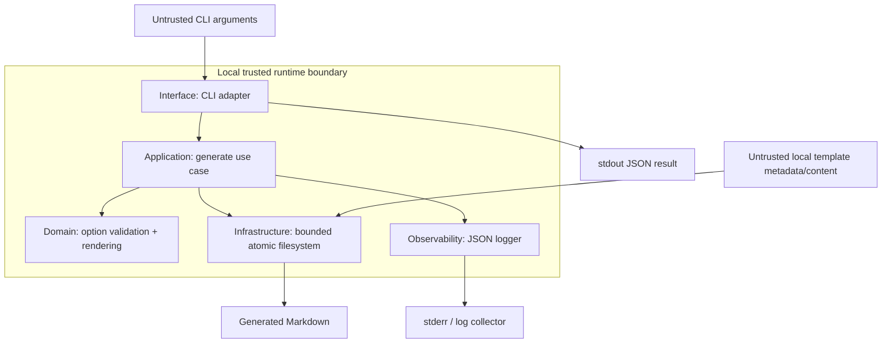
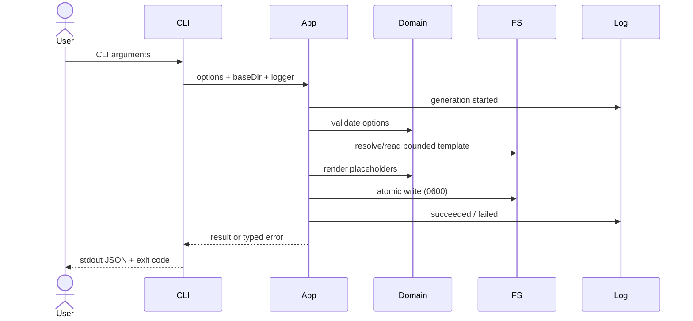
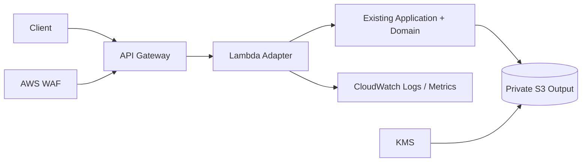

# Architecture

## Scope

這是一個模組化單體 Node.js CLI。企業級在此代表清楚邊界、可靠驗證、安全 I/O、可觀測性與可部署演進路線，不代表必須使用微服務。

## Component diagram

## Dependency rule

- `domain` 不依賴 filesystem、CLI 或 logger。
- `application` 協調 domain 與 infrastructure；只允許 module-owned bundled template 越過 caller cwd boundary。
- `infrastructure` 封裝路徑、filesystem identity 與 atomic write。
- `interface` 解析參數、設定 exit code，不包含業務規則。
- `observability` 只輸出 allowlisted operational metadata。

## Data flow

## Failure modes

| Failure | Control | Result |
|---|---|---|
| Invalid domain/environment/control character | Domain validation | non-zero exit + structured error event |
| Markdown/HTML content injection | contextual escaping of inserted values | rendered as text |
| Path traversal | lexical boundary + component symlink checks for custom paths | rejected before I/O |
| Template/output alias | filesystem device/inode identity check | rejected |
| Partial write | temp file + same-directory atomic rename | old file remains or complete new file |
| Oversized/non-file template | stat + 1 MiB limit | rejected |
| Unknown/malformed placeholder | scan for any remaining `{{` or `}}` | rejected |
| Log forgery or secret fields | logger-owned schema + scalar allowlist | unapproved fields dropped |

## Cloud evolution reference (not deployed)

服務化前需補：authentication/authorization、request schema、rate limit、idempotency、timeouts、Lambda/S3 adapters、IaC、CloudWatch alarms、X-Ray traces、load test、backup/retention 與成本模型。

## Quality attributes

- **Security:** deny unexpected inputs, bounded file access, minimal data in logs.
- **Reliability:** deterministic rendering and atomic output.
- **Maintainability:** dependency direction and built-in-only runtime.
- **Performance:** O(template size), bounded at 1 MiB；沒有證據前不做額外最佳化。
- **Portability:** Node.js 22+；filesystem mode 在非 POSIX 平台可能不完全等價。
