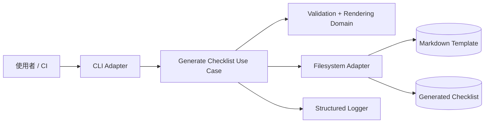

# AWS Static Site Checklist Generator — Portfolio Case Study

## 一句話價值主張

將 S3、CloudFront、DNS、安全、監控與回復程序的部署知識，轉成可重複執行、可測試的 Markdown 上線檢查清單產生器。

> 狀態說明：這是已在本機與 CI 驗證的 AWS/Ops 作品模板，**尚未部署到 AWS，也沒有建立任何付費雲端資源**。

## 問題背景

靜態網站部署看似簡單，但正式上線時容易遺漏 HTTPS、S3 公開存取、CloudFront 快取、錯誤頁、DNS、監控與 rollback 等項目。手動從記憶檢查不一致，也不利於團隊或客戶審查。

## 限制與需求

- 不依賴 AWS 帳號或金鑰即可展示。
- 不建立 AWS 資源，不產生雲端費用。
- 以命令列參數輸入專案資訊。
- 輸出容易閱讀與交付的 Markdown。
- 重要行為具備自動測試與可重複驗證指令。

## 架構與資料流



## 實作摘要

- 使用 Node.js ES modules，沒有第三方 runtime dependency。
- CLI、application、domain、filesystem 與 observability 分層，依賴方向朝核心。
- `src/generate-checklist.js` 是 CLI adapter；application use case 協調驗證、rendering、I/O 與 logging。
- `templates/aws-static-site-deploy-checklist.md` 收錄 S3、CloudFront、DNS、安全、監控及回復程序檢查項目。
- `node:test` 涵蓋 unit、security、真實檔案 I/O integration 與 child-process E2E。
- `npm run generate` 可產生 `examples/example-output.md`。

## IAM／資安設計

目前版本完全不呼叫 AWS API，因此不需要 IAM role、access key 或 `.env`。安全控制包含：

- S3 Block Public Access 與 origin access 檢查項目。
- HTTPS certificate 與 redirect 檢查項目。
- 不將 secrets 放入靜態網站的檢查項目。
- Domain、environment、控制字元與 template placeholder 驗證。
- Markdown／HTML contextual escaping。
- Path traversal、symlink 與 case-insensitive alias 防護。
- 1 MiB template 上限、同目錄 atomic write 與 `0600` output mode。
- Structured log schema 由 logger 擁有，避免呼叫端偽造保留欄位。

若未來加入 AWS API，應採唯讀、短效憑證與最小權限 IAM，並將驗證與部署權限分開。

## 成本與可靠性考量

- 本機執行不建立 AWS 資源。
- 使用 Node.js 內建測試框架，沒有第三方 runtime dependency。
- 產生器可重複執行，輸出能納入 code review 或交付流程。
- GitHub Actions 以 Node.js 22、24 matrix 驗證主要品質閘門。
- 尚未驗證真實 AWS distribution、bucket、DNS 或 CloudWatch，因此不宣稱完成正式環境驗證。

## 測試與驗證證據

2026-07-23 在 Node.js v22.22.2、npm 10.9.7 實際執行：

```text
npm test
# tests 14
# pass 14
# fail 0
```

```text
npm run coverage
# lines 97.92%
# branches 92.80%
# functions 96.97%
```

```text
npm audit --omit=dev --audit-level=high
found 0 vulnerabilities
```

目前測試涵蓋：

1. CLI 參數、domain、environment 與控制字元驗證。
2. Markdown／HTML escaping 與 placeholder 完整性。
3. Path traversal、symlink 與 case-insensitive alias 防護。
4. Template 大小上限、atomic write 與 `0600` output mode。
5. Structured log schema 與 single failure event。
6. 真實檔案 I/O integration 與 child-process E2E。

完整、可重跑的證據與限制請見 [`docs/verification.md`](../verification.md)。

## 成果

- 已產生可交付的 Markdown checklist 範例。
- 14 個自動測試全部通過，line coverage 97.92%。
- Dependency audit 為 0 vulnerabilities。
- 將 AWS 靜態網站上線知識包裝成可重複使用的作品工具。
- 真實客戶節省時間、正式環境缺陷率與 AWS 成本數據：**待補，不虛構**。

## 履歷 Bullet

Built a dependency-free Node.js AWS static-site readiness checklist generator that converts S3, CloudFront, DNS, security, monitoring, and rollback requirements into reusable Markdown artifacts, backed by 14 unit, integration, security, and E2E tests with 97.92% line coverage.

## STAR 面試故事

- **Situation：** 靜態網站正式上線容易因人工檢查不一致，遺漏 CDN、DNS、安全或回復程序。
- **Task：** 建立一個不需 AWS 帳號、可重複展示且容易交付的部署檢查工具。
- **Action：** 將 S3／CloudFront 上線知識整理成 Markdown 模板，採模組化單體實作 Node.js CLI，加入輸入與路徑邊界、atomic write、結構化日誌，以及 unit／integration／security／E2E 測試。
- **Result：** 14/14 測試通過、line coverage 97.92%、dependency audit 0 vulnerabilities；目前成果為本地與 CI 可驗證模板，正式 AWS 部署成效仍待未來實作驗證。

## 後續改善

1. 支援 JSON config。
2. 增加 Lambda、ECS、RDS 與 IAM review 模板。
3. 加入 Markdown link 與 checklist schema 驗證。
4. 經使用者確認後，再考慮以唯讀 AWS API 進行實際設定驗證。
